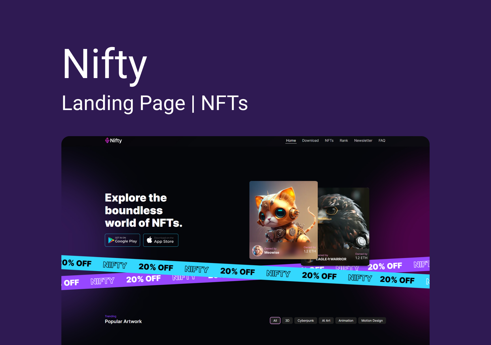

<div align="center">

  # Nifty
  
  <p>Landing Page | NFTs</p>
  
   &nbsp;
   &nbsp;
   &nbsp;
   &nbsp;

  
</div>

<div>

  # Aprendizados
  Usar comandos de prompts para gerar artes com AIs (Dall-E | Midjourney)<br />
  Trabalhar com layout de outros (Curso de Figma by FeUX), layout temático e exclusivo (NFT)
  <br /><br />

  # <b>[Ver online 🡽](https://nifty-nfts.softwarealles.repl.co)</b>

  ## Clone

  ```
  git clone git@github.com:DiogoRealles/nifty.git
  ```
</div>


<footer>
  <p>Gostou? deixa seu like!</p>
  <p>Estou disponível para realizar seus projetos</p>
  <a href="mailto:diogorealles@hotmail.com"></a>
  <a href="https://www.linkedin.com/in/diogorealles/"></a>
  
  <p><strong>Diogo Realles | 2024</strong></p>
</footer>
